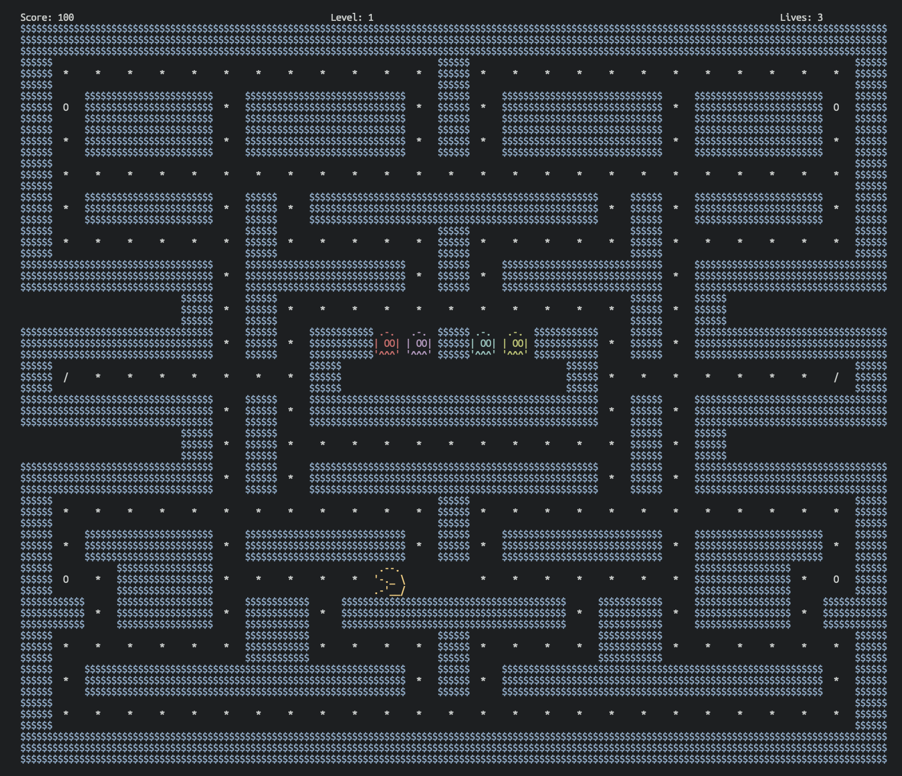

## Compile and run
- `gcc main.c -lcurses && ./a.out map3.txt`

## Map creation:

- `W` is for a wall
- `p` is for Pacman starting location
- `g` is for the spawn of a single ghost.
    - Each g on the map will represent that ghosts starting location and respawn point.
    - Max ghosts is 4
    - Ghosts have 4 modes just like in the arcade version: scatter, chase, frightened, and dead
- Number represents the target square for the ghost when in Scatter mode. 1: for ghost one, 2: for ghost two...
- `/` is a teleporter. When Pacman or a ghost lands on one, they will teleport to the location of the other teleporter location.
    - If only one teleporter is placed, it does not do anything
- Spaces represent where normal food will be placed.
- `.` are powerup foods.
- `-` is a space where neither ghosts or pacman can enter.
    - Generally useful for filling up the ghost house.

